# 🎓 Smart Attendance Management System


 

## 🎯 Project Objective

The Smart Attendance Management System was developed to simplify attendance management in educational institutions by replacing manual attendance with a secure QR-based solution. The system improves efficiency, reduces proxy attendance, and provides real-time reporting for administrators, teachers, and students. A modern Flutter & Firebase-based Smart Attendance Management System designed for educational institutions. The application provides secure role-based authentication, QR code attendance, smart reporting, and efficient management of students, teachers, and courses.

---

## 🚀 Features

### 👨‍💼 Admin Panel
- Secure Admin Login
- Manage Students
- Manage Teachers
- Manage Courses
- View Student Details
- View Teacher Profiles

### 👨‍🏫 Teacher Panel
- Secure Login
- Generate QR Code Attendance
- View Attendance Records
- Smart Attendance Reports

### 👨‍🎓 Student Panel
- Secure Login
- Mark Attendance using QR Code
- View Attendance History
- Smart Attendance Reports

---

## 🔐 Authentication

- Firebase Authentication
- Role-Based Login
- Secure User Access

---

## 🛠️ Tech Stack

| Technology | Purpose |
|------------|---------|
| Flutter | Cross-platform Mobile Application Development |
| Dart | Programming Language |
| Firebase Authentication | Secure User Authentication |
| Cloud Firestore | Cloud Database |
| QR Code Generator | Attendance QR Generation |
| Mobile Scanner | QR Code Scanning |
| Android Studio | Development Environment |
| Git & GitHub | Version Control |


## ✨ Key Features

- 🔐 **Role-Based Authentication**
  - Secure login system for **Admin, Teacher, and Student**.

- 📱 **QR Code Attendance**
  - Teachers generate unique QR codes for each class session.
  - Students scan QR codes to mark attendance instantly.

- 🛡️ **Device Binding**
  - Attendance can only be marked from the registered device to reduce misuse.

- 🚫 **Proxy Attendance Detection**
  - Prevents unauthorized or duplicate attendance attempts.

- 👨‍🎓 **Student Management**
  - Add, update, and manage student records efficiently.

- 👨‍🏫 **Teacher Management**
  - Manage teacher profiles and assigned courses.

- 📚 **Course Management**
  - Create and manage subjects and course allocations.

- 📊 **Smart Attendance Reports**
  - View attendance summaries and detailed reports.

- ☁️ **Firebase Integration**
  - Firebase Authentication and Cloud Firestore for secure real-time data storage.

- 🎨 **Modern Flutter UI**
  - Responsive and user-friendly interface built with Flutter.

## 📂 Project Structure

```
lib/
 ├── screens/
 │    ├── admin/
 │    ├── teacher/
 │    ├── student/
 │    └── login/
 ├── main.dart
```

---
## 🎥 Demo Videos

### 👨‍🏫 Teacher Workflow
[▶️ Watch Teacher Demo](demo/teacher-demo.mp4)

### 👨‍🎓 Student Workflow
[▶️ Watch Student Demo](demo/student-demo.mp4)

---

## 📄 Project Presentation

📑 [View Project Presentation (PDF)](docs/Smart_Attendance_Management_System_Presentation.pdf)

## 📸 Application Screenshots

<table>
<tr>
<td align="center"><b>Splash Screen</b></td>
<td align="center"><b>Role Selection</b></td>
</tr>

<tr>
<td>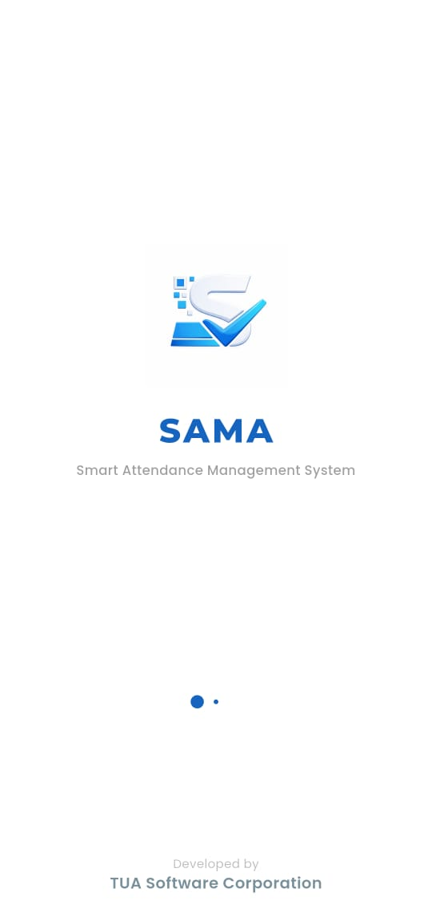</td>
<td>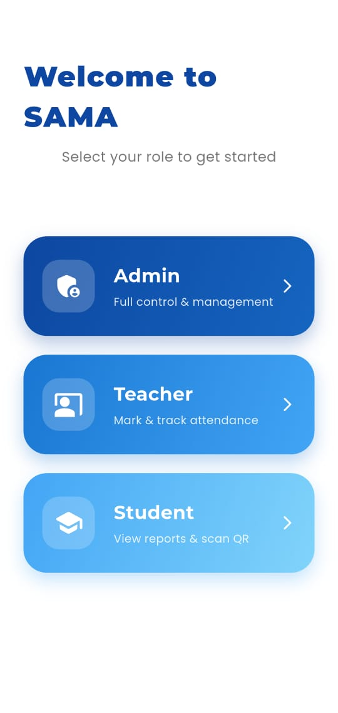</td>
</tr>

<tr>
<td align="center"><b>Admin Dashboard</b></td>
<td align="center"><b>Teacher Dashboard</b></td>
</tr>

<tr>
<td>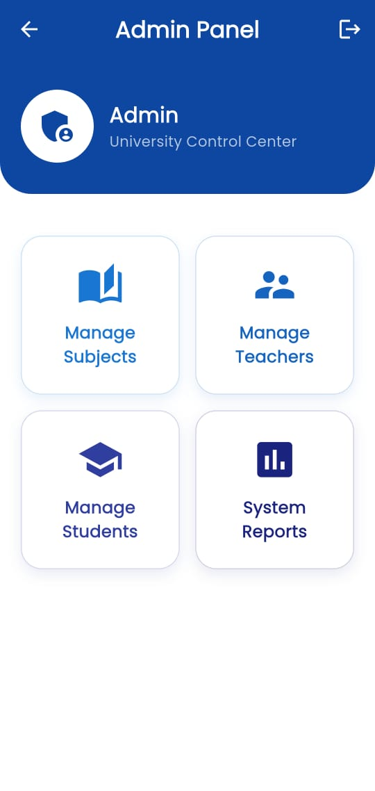</td>
<td>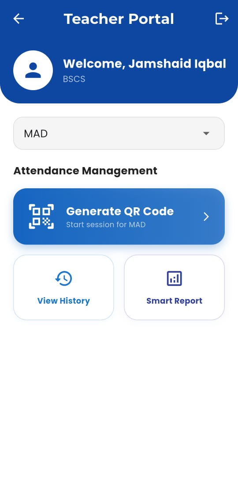</td>
</tr>

<tr>
<td align="center"><b>Student Dashboard</b></td>
<td align="center"><b>QR Generator</b></td>
</tr>

<tr>
<td>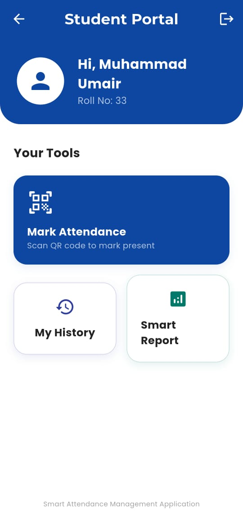</td>
<td>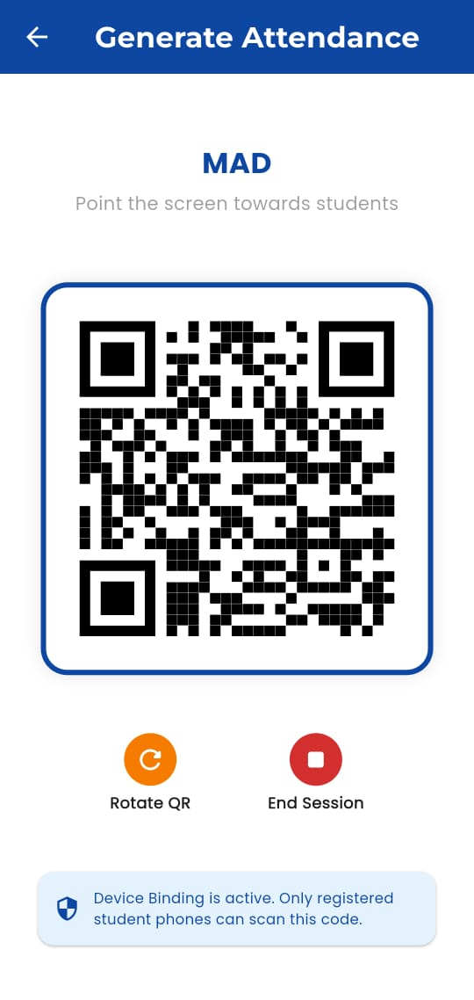</td>
</tr>

<tr>
<td align="center"><b>QR Scanner</b></td>
<td align="center"><b>Attendance</b></td>
</tr>

<tr>
<td>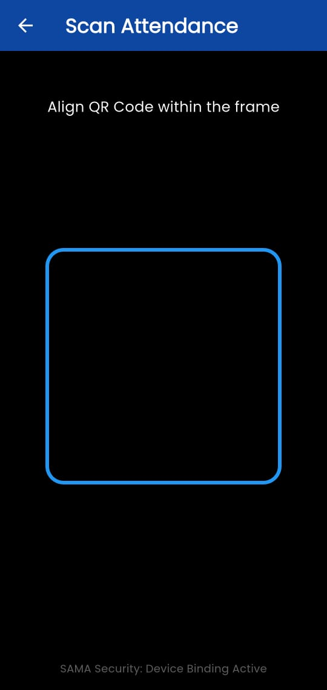</td>
<td></td>
</tr>

<tr>
<td align="center"><b>Manage Students</b></td>
<td align="center"><b>Manage Teachers</b></td>
</tr>

<tr>
<td>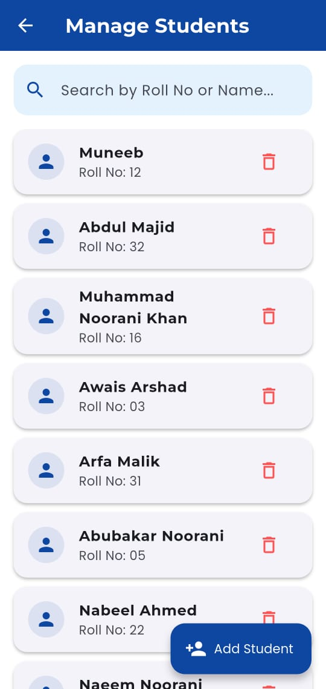</td>
<td>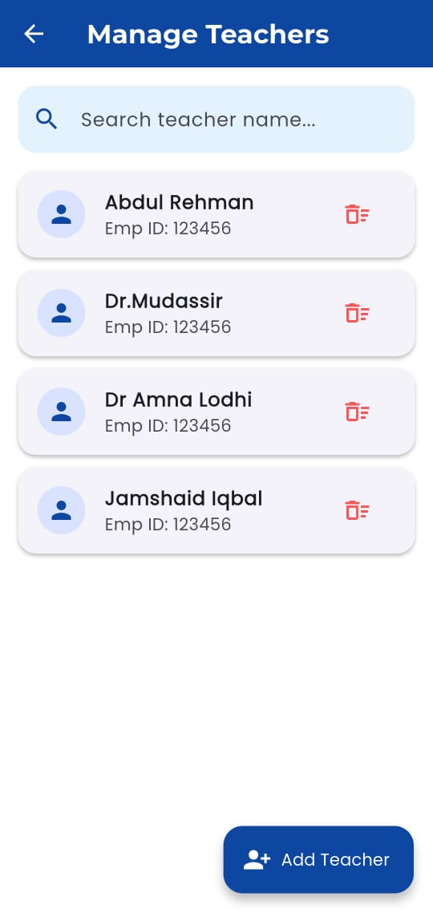</td>
</tr>

<tr>
<td align="center"><b>Manage Courses</b></td>
<td align="center"><b>Attendance Report</b></td>
</tr>

<tr>
<td>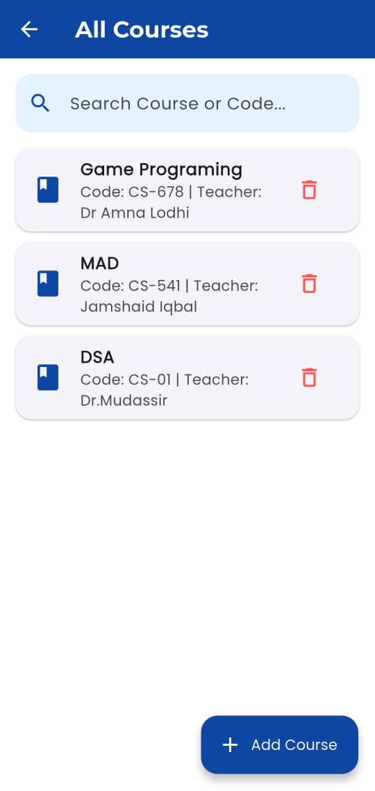</td>
<td>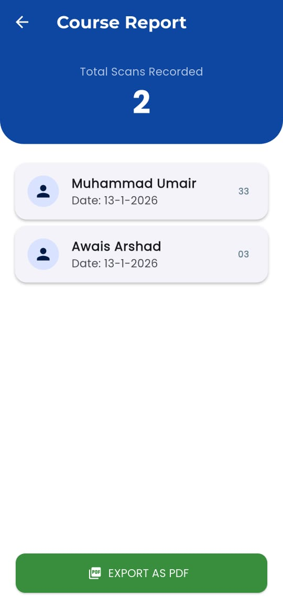</td>
</tr>

<tr>
<td align="center"><b>Proxy Detection</b></td>
<td></td>
</tr>

<tr>
<td>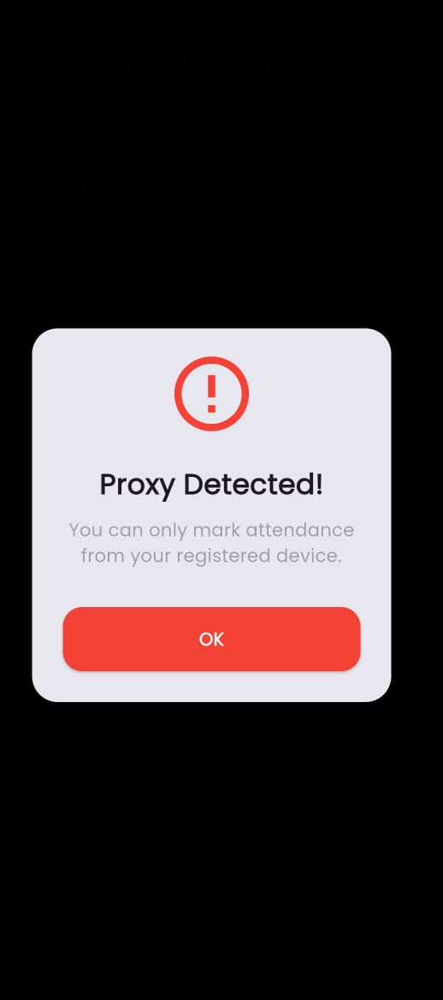</td>
<td></td>
</tr>

</table>  


## 🚀 Getting Started

### Prerequisites

- Flutter SDK
- Android Studio
- Firebase Project

### Installation

```bash
git clone https://github.com/the-umair-arsh/smart-attendance-management-system.git

cd smart-attendance-management-system

flutter pub get

flutter run
```
## 🔮 Future Improvements

- Face Recognition Attendance
- Push Notifications
- Attendance Analytics Dashboard
- Export Reports (PDF & Excel)
- AI-Based Attendance Insights

---

## 👨‍💻 Developed By

**Muhammad Umair**

Software Design and Architecture | Flutter Developer | Web Developer | Software Engineering Student 

### 📫 Connect

- GitHub: https://github.com/the-umair-arsh
- LinkedIn: https://linkedin.com/in/muhammad-umair-se
- Email: aumairarshad376@gmail.com
---

## ⭐ Support

If you found this project useful, consider giving it a ⭐ on GitHub.
